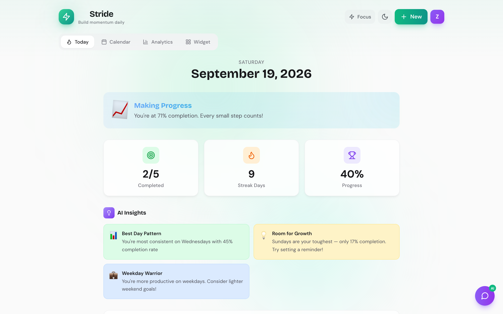
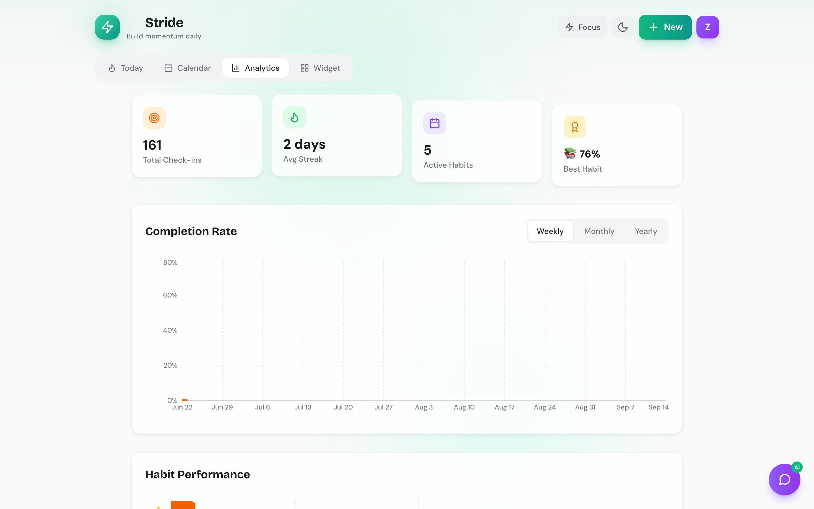
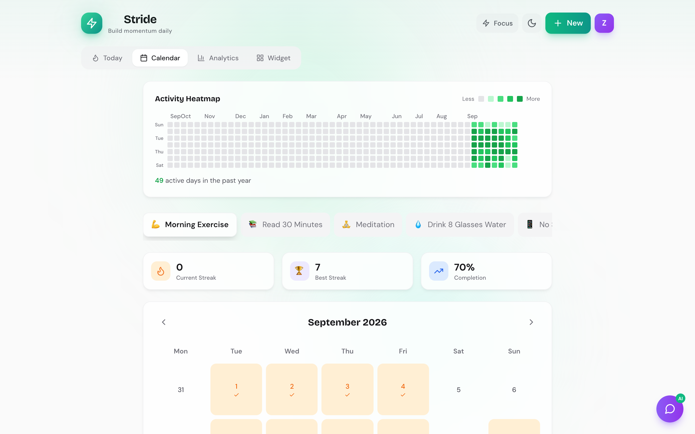
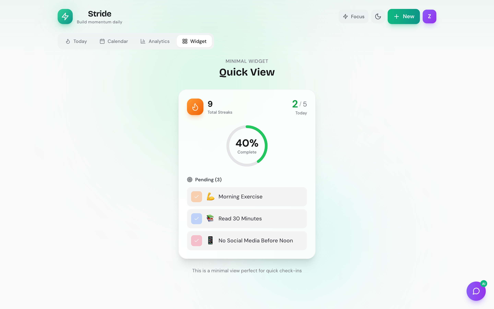

# Stride — Habit Tracker

**Stride** is a habit-tracking web app built with React and Vite. You can log habits day by day, browse a calendar and heatmap, review analytics and streaks, and switch between light and dark themes. Accounts and data are stored in the browser (**localStorage**); there is no backend in this repo.



## Features

- Today, calendar, analytics, and widget-style views  
- Streaks, completion history, and charts (Recharts)  
- Simple email/password auth stored locally (optional)  
- Light/dark theme  

## Screens

| | |
|---|---|
|  |  |
|  |  |

## Tech stack

- React 18, Vite 4  
- Tailwind CSS, Framer Motion, Lucide icons  
- date-fns, Recharts  

## Prerequisites

- **Node.js** 20.x recommended (18+ usually works)

## Run locally

```bash
npm install
npm run dev
```

Open the URL Vite prints (typically `http://localhost:5173`).

### Production build

```bash
npm run build
npm run preview
```

`npm run preview` serves the built output from `dist/` so you can check the production bundle locally.
